# Winget Helper

A graphical interface for Winget

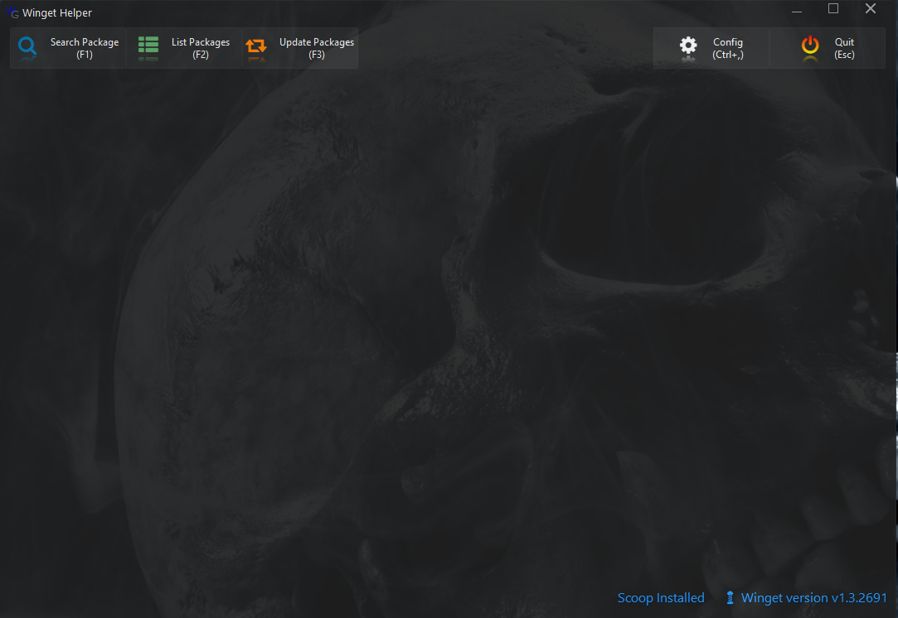

A Brief demo video is available there : 

## Installation
The setup of the latest release is available here : https://github.com/Yves848/WinDel/releases/download/0.2.0.2/Setup.exe

## History

### 0.2.0.2
  - Installer (Setup.exe)
  - Config pane
  - Windows notifications on package upgrade available
  - Can start with winndows session
  - Can run hidden (Tray icon menu available)

***
# Screenshots

## Configuration
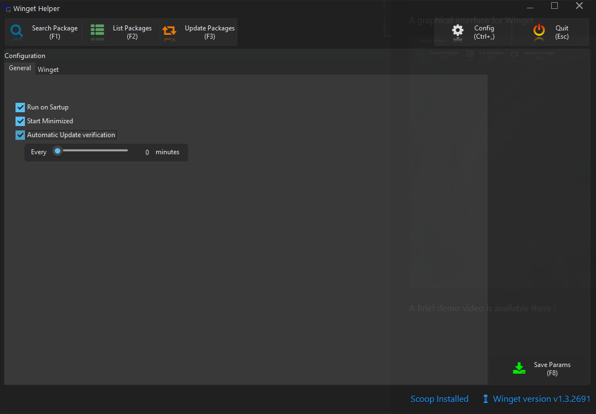
## Notifications
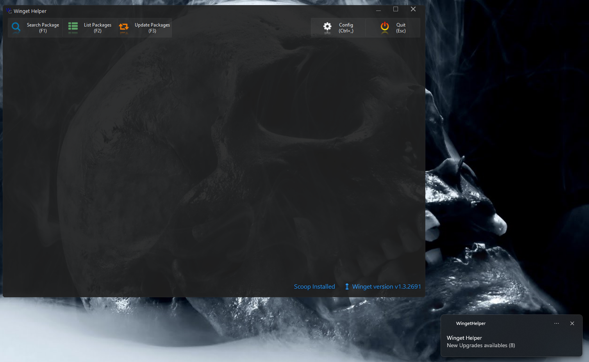
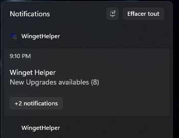

## Package Searching

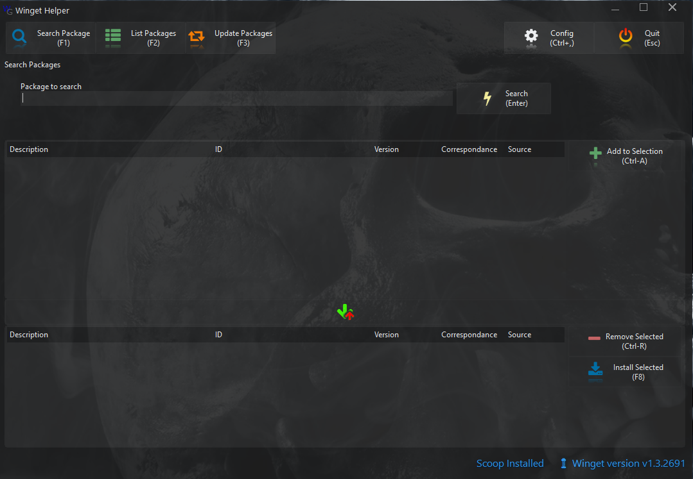
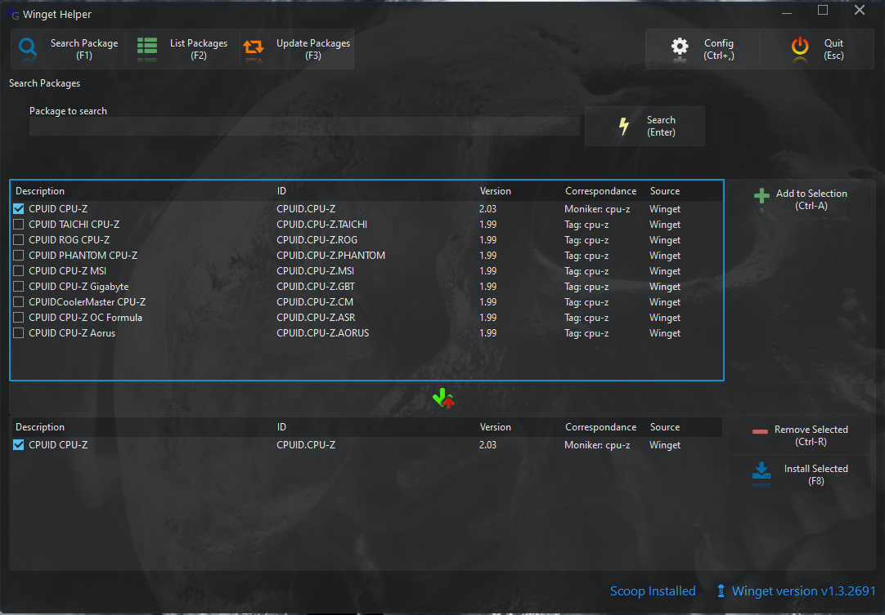
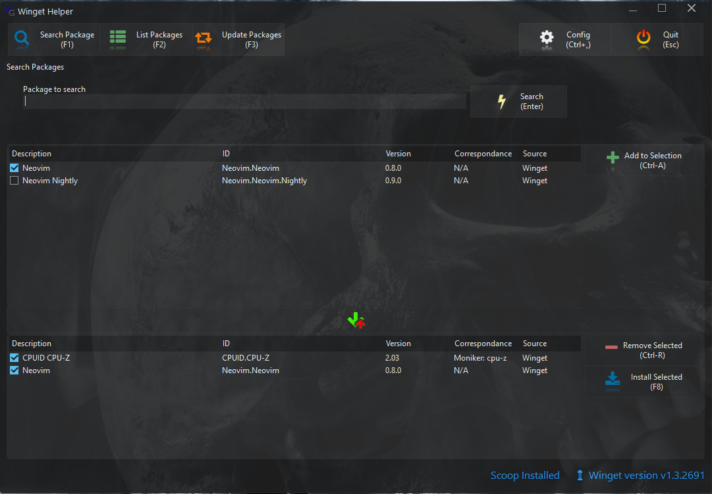

## Packages Installed
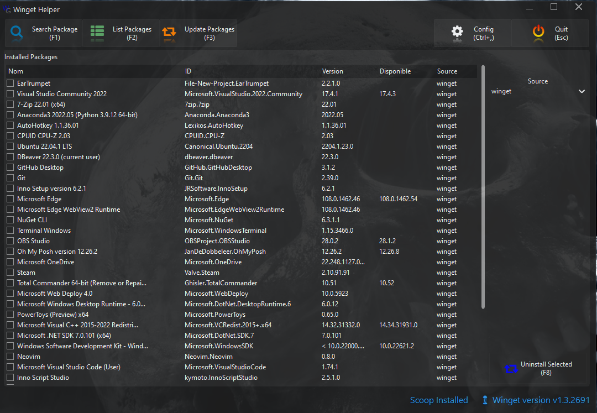

## Packages Upgrade
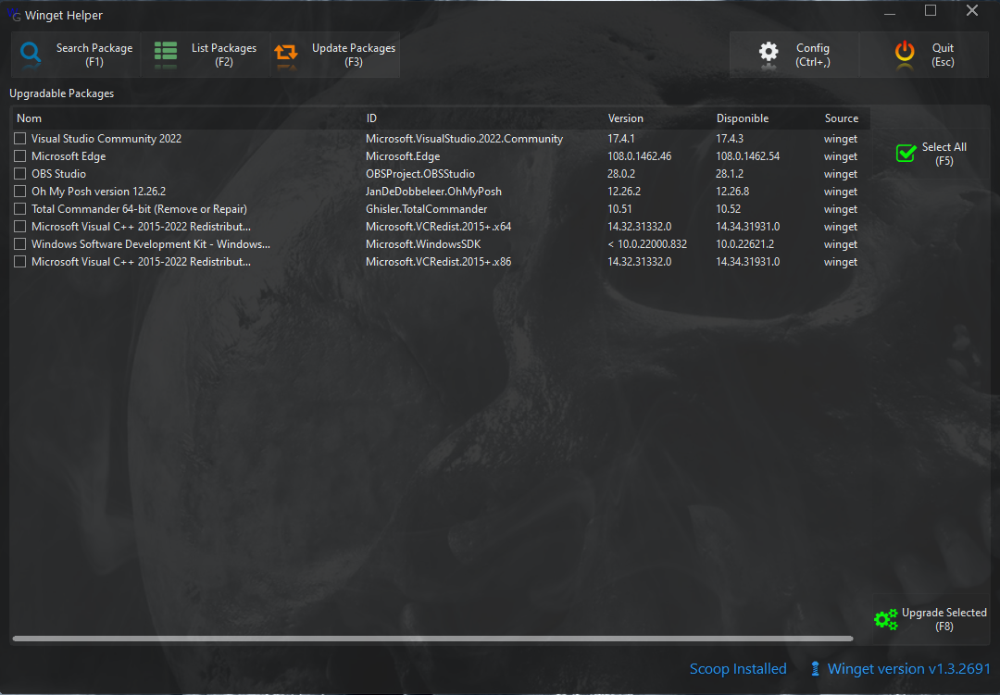

## Closing the application
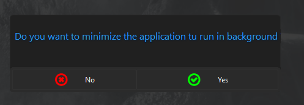

If the user click "Yes", the application minimize in tray an continue running in background. 
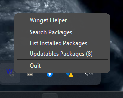

 If autocheck of the upgrades is configured, the notifications will be displayed.
If "No" is choosed, the application quits.

